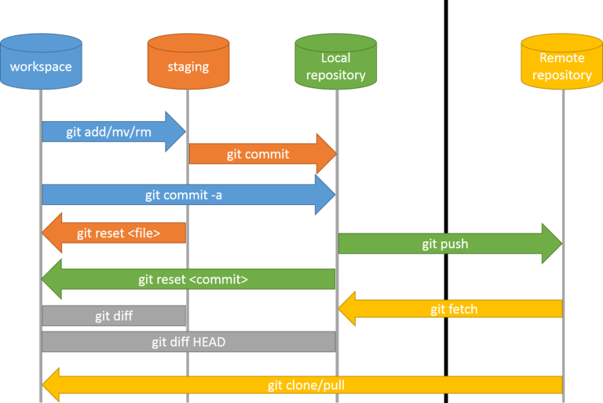

# Fluxo de Desenvolvimento do Projeto

Nosso projeto utiliza o Git como controle de versão e o GitHub para hospedagem do repositório remoto. Também usamos o GitHub para gestão de tarefas e criação da documentação.

## Fluxo de Desenvolvimento com Git

Na página com Tutorial [Git e GitHub](github.md) apresentamos o **Fluxo de Trabalho Git** com repositório local e repositório remoto no **GitHub**. Conforme exibido na imagem a seguir:

Contudo, esse fluxo de trabalho descreve apenas as operações realizadas com Git para adição e envio das contribuições para o repositório remoto. Para uma utilização efetiva iremos utilizar um desenvolvimento baseado em multiplos branches.

## Fluxo de Desenvolvimento com GitFlow

[GitFlow](https://nvie.com/posts/a-successful-git-branching-model/) é um modelo de desenvolvimento baseado em branches para Git, criado por Vincent Driessen. Ele atraiu muita atenção porque é muito adequado para colaboração e dimensionamento da equipe de desenvolvimento.

No nosso projeto utilizamos apenas as branches:

* branch **main**: branch principal com o código integrado e verificado.
* branch **feat/issueX**: branch para a feature descrita na issue de id = X.
* branch **fix/issueY**: branch para a hotfix de bugs descrita na issue de id = Y.
* branch **doc/issueZ**: branch para documentação do projeto, criação de tutoriais ou documentação no código, descrita na issue de id = Z.

Neste momento não estamos utilizando branches de **develop** e **release**. Concordamos com a abordagem utilizada por Paulo Moura no seu post [Git-flow o anti-pattern mais querido da galera](https://tasafo.org/2019/01/18/git-flow-o-anti-pattern-mais-querido-da-galera/).

## Para saber mais

* https://datasift.github.io/gitflow/IntroducingGitFlow.html
* https://imasters.com.br/agile/fluxo-de-desenvolvimento-com-gitflow
* https://www.atlassian.com/br/git/tutorials/comparing-workflows/gitflow-workflow
* https://tasafo.org/2019/01/18/git-flow-o-anti-pattern-mais-querido-da-galera/